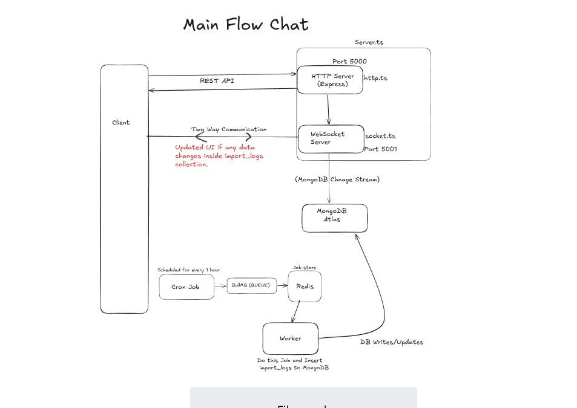

# 🧱 Architecture Overview

**Project:** `Knovator Job Importer`  
**Author:** Asher9889  
**Tech Stack:** `Node.js`, `Express`, `Next.js`, `Socket.IO`, `MongoDB`, `BullMQ`, `Redis`, `TypeScript`

---

<h2>📊 Architecture</h2>

[Click Here to see in ExcaliDraw](https://excalidraw.com/#json=NtGx28Osr02nVidNA1ZMh,LgHIBGfGhw1zKSo_LG-LMw)

---

## 🧩 Why I Split `http.ts` and `socketHandler.ts`

| File               | Responsibility                                                       |
|--------------------|----------------------------------------------------------------------|
| `http.ts`          | Bootstraps the Express server, middleware, and REST API              |
| `socketHandler.ts` | Creates a dedicated WebSocket server and sets up real-time updates   |
| `server.ts`        | Combines both modules and orchestrates full server startup           |

### ✅ Reasons for Splitting:
- **Separation of Concerns**: Keeps HTTP and WebSocket logic independent and clean.
- **Scalability**: Allows future expansion like clustering, redis adapter for sockets, or running sockets separately.
- **Reusability**: Makes it easier to use the same WebSocket setup across different services (e.g., if moved to microservices).
- **Maintainability**: When bugs happen in real-time vs API, they're logically isolated.

---

## ⚙️ Core System Logic

### 1. **Cron Job + Job Import Logic**
- Runs every 1 hours using `node-cron`.
- Fetches job listings from multiple external APIs (defined in `jobUrl.ts`).
- Normalizes the data (via `normalizedData.ts` & `shapeRawData.ts`).
- Adds each job into a **BullMQ queue** (`jobQueue.ts`).

### 2. **Queue Processing with BullMQ**
- Jobs are added to Redis via BullMQ.
- A **dedicated worker** (`worker.ts`) pulls from the queue.
- Each job is:
  - Validated
  - Transformed
  - Inserted into `jobs` collection
  - Import summary is logged in `import_logs` collection

### 3. **Real-Time Updates with MongoDB Change Streams + Socket.IO**
- MongoDB Change Stream watches the `import_logs` collection.
- When a new import log is inserted, the WebSocket server emits a real-time event (`import-logs-update`).
- Frontend (Next.js) listens for this socket event and **prepends** the new log in the UI.

### 4. **Frontend Integration**
- UI built using Next.js (App Router).
- Fetches initial logs via REST (`/api/v1/job/import-jobs?page=1&limit=20`).
- Subscribes to WebSocket server for real-time updates.
- Maintains a maximum of 20 logs on the frontend, always keeping the latest on top.

---

## 🔐 Error Handling Strategy

- Custom classes like `ApiErrorResponse` and `ApiSuccessResponse` standardize all API responses.
- A global error middleware (`globalErrorHandler.ts`) ensures graceful error handling for unexpected failures.
- All async routes use proper `try/catch` with typed error throwing.

---

## 📡 Redis Use Cases

- Redis acts as a **queue store** for BullMQ (required for job queueing, retry logic, scheduling).
- Redis is prepared for future usage in **WebSocket scaling** (via `socket.io-redis` adapter).

---

## 🧪 Testing Strategy

- Manual testing of cron jobs (via `npm run cron`)
- Socket connection testing with event logs
- API tested using `Postman` and UI checks

---

## 📈 Scalability Potential

- Redis and BullMQ allow horizontal scaling of workers
- MongoDB Change Stream supports sharded clusters
- `socketHandler.ts` can be adapted for Redis pub/sub with `socket.io-redis` adapter
- Microservice-ready due to separation of queue, socket, HTTP, and worker layers

---

## 🗂 Key System Modules

| File/Module                  | Role |
|-----------------------------|------|
| `scheduler.ts`              | Cron scheduler that triggers job import every 3 mins |
| `job.service.ts`            | Business logic for validating & saving jobs |
| `jobQueue.ts`               | Initializes BullMQ queue |
| `worker.ts`                 | Worker that processes and inserts jobs into DB |
| `socketHandler.ts`          | Sets up WebSocket server and MongoDB change stream |
| `connectMongoDB.ts`         | Connects to MongoDB Atlas |
| `job.routes.ts`             | REST API to fetch import logs |
| `ApiErrorResponse.ts`       | Custom error response class |
| `shapeRawData.ts`           | Converts API-specific structure to common format |
| `normalizedData.ts`         | Normalizes location, tags, job-type, etc. |

---

## 🔄 Event Flow Summary

1. **Cron triggers fetch**
2. **Jobs pushed to BullMQ**
3. **Worker inserts jobs + import logs**
4. **MongoDB Change Stream detects log insertion**
5. **WebSocket emits new log to client**
6. **Client UI updates in real time**

---

## 🏁 Conclusion

This architecture provides:
- Clean separation between API, real-time, and background jobs
- Real-time user experience powered by MongoDB Change Streams + Socket.IO
- Robust queue-based ingestion pipeline with retry and scaling capability
- Maintainable TypeScript structure across client and server

> ✅ Designed for clarity, extensibility, and production-grade behavior.